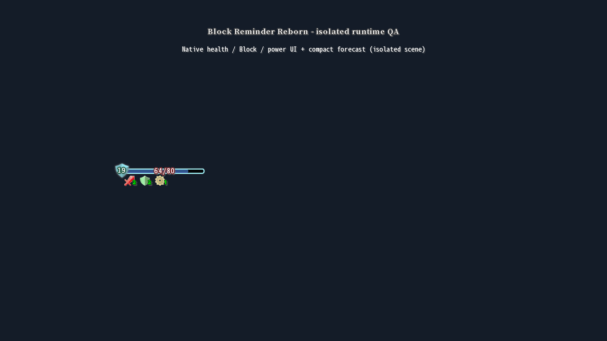
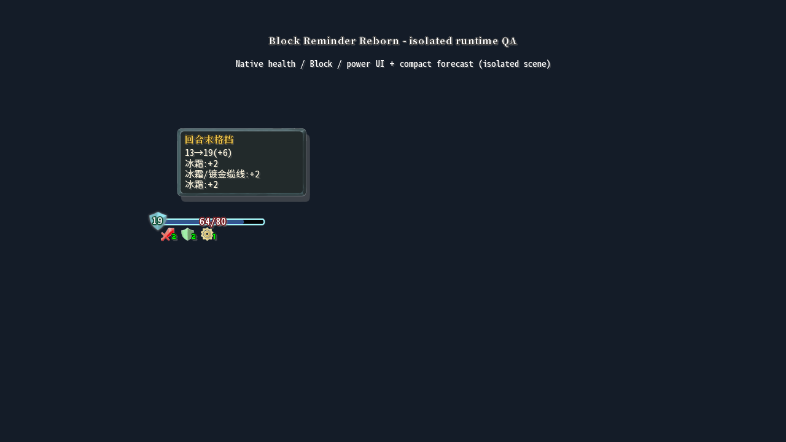

# 验证记录

2026-10-07 工坊发布准备：1.0.9 作者统一为「芝士龙」，更新模组元信息、设置徽章署名及 MIT 版权署名，未改变计算或显示逻辑。重新构建通过 70 项核心断言及发布包审计；逐项扫描 JAR，确认不存在旧占位署名。当前 SHA-256 为 `a9d741ad3ca11bf77507c3caf8139e2e71b9e5fb7ddf920be1de984692d3e645`，上传目录中的 JAR 与 dist 一致。工坊工作区为 `<workshop-directory>`；封面待用户提供，尚未上传。下方旧校验值对应改署名前的构建。

2026-10-07 的 1.0.9 修复发布前检查发现的两项问题。适配层只读检测未知能力/遗物的受伤、攻击、生命损失及破盾等回调，将标志带入纯计算；存在非零伤害事件时保留部分预估提示，没有伤害事件时不因此误报，成功扩展可声明覆盖。完全被格挡吸收的灼伤最小复现从 `forecast=1, actual=5, exact=true` 改为 `exact=false` 并显示未知来源；预览仍不执行任何实际回调。核心新增七项回归，共 70 项通过。

构建、审计和 smoke 脚本改为 UTF-8 BOM，兼容 Windows PowerShell 5.1 的中文路径；原生命令的 stderr 记录后按退出码及成功标记判断，避免 MTS 离线 Steam 提示终止正常检查。PowerShell 5.1 完整构建、默认路径审计和简中 720p + StSLib 已通过；PowerShell 7 的英文 1080p + StSLib、繁中 720p 各通过 323 项真实游戏及渲染断言。新增真实 Burn 受伤动作、未知遗物/生命损失回调、无伤害准确性以及截图 framebuffer 与请求尺寸一致性检查。原版四组来源动作探针对照仍一致。没有重跑全部 24 种语言或完整对局；多人与第三方全组合的验证限制不变。1.0.9 JAR 为 74,155 字节，SHA-256 为 `4de9d2250ecd3a5d3b99e2918f6b41a075e2fc061797fe4abc4a74ed26f336de`。

首次验证：2026-10-06。视觉更新验证：2026-10-07，版本 1.0.1。本记录区分纯计算、真实加载、测试夹具与未验证的多人实战。

2026-10-07 的 1.0.2 文案更新将模组名改为「格挡计数」，设置名改为「启用」「显示总量」「消耗计数护盾」「始终显示」，模组列表说明改为简短中文。已读取生成的 JAR，确认元信息及三种语言资源；重新构建通过 61 项核心断言和发布包审计（24 个 Java 8 类文件、SHA-256 一致）。本次只修改文案，下述运行场景及截图仍为 1.0.1 的验证记录。

同日 1.0.3 将第三项恢复为「计入虚无牌消耗与无惧疼痛」，同步恢复繁中和英文文案。构建的 61 项核心断言及发布包审计通过；JAR 内三种语言各包含 24 项文案，第三项内容已读取确认。设置和提示按游戏语言选择简中、繁中或英文，来源名称使用游戏/对应模组提供的名称；模组列表的名称与简介为固定中文。此版本仍仅修改文案。

同日 1.0.4 扩展至游戏本体的全部 24 种正常语言，每种语言 24 项文案。语言选择改为按游戏枚举查找资源，缺失时回退英文，并使用 Locale.ROOT 处理路径大小写。61 项核心断言和发布包审计通过。24 种语言均以 BaseMod 单独加载、1280 × 720 运行隔离场景，每种通过 81 项真实游戏及渲染断言，包含语言资源选择、土耳其语系统区域设置、WWW 英文回退、字体覆盖和设置文字宽度；人工检查日文、泰文部分预估截图。记录位于 build/language-smoke-report.json，各语言截图位于 build/language-qa；完整语言及翻译边界见 [语言支持](localization.md)。新增翻译尚未经过母语审校。本版本未重新运行 StSLib 或完整实战组合。

## 已通过

2026-10-07 的 1.0.8 将构建、审计、隔离加载脚本及校验文件统一改为「更好的格挡显示.jar」；dist 内旧名的 1.0.7 产物移至 build/legacy-artifacts/1.0.7 保存。修复结束回合后 12 回退到 10 再增加到 12 的重复显示：在真实结束回合按钮 disable(true) 前缓存最新预计值，玩家回合末结算时保留，敌方排队或新玩家回合开始时清除。仅抑制玩家结算期间的 addBlock 放大/闪色及初次获得格挡动画，格挡字段和原生回调照常处理；初次增益保持原版护盾透明度，敌方扣格挡恢复即时显示。

修复前真实按钮场景复现 `expected 12, actual 10`，进一步检查复现原版放大状态残留；修复后原生 GainBlockAction 分次将实际 10 加到 12，显示始终为 12，动画状态不残留。覆盖零当前格挡初次增益、关闭模组及敌方扣 3 后显示 9。63 项核心断言、36 个 Java 8 类的发布包审计与 SHA-256 通过；简中 720p、英文 1080p（StSLib 2.12.0）各通过 282 项真实游戏/渲染断言。人工对照简中结算前、按钮后、增益后截图及英文增益后截图，护盾数字保持 12；本次未验证完整对局或所有第三方结束回合实现。

2026-10-07 的 1.0.7 修复取消「始终显示」后仍显示零格挡：旧判断因当前格挡大于零或存在不确定性而强制显示，改为预计值大于零或勾选开关才显示。预估可用与可见分开判断，隐藏零值时不误退回当前值；护盾及对应悬浮提示同步隐藏，回合结束仍恢复原版实际值。修复前隔离检查复现 `unchecked Always Show hides zero forecast 1` 失败，修复后覆盖准确零值、部分预估零值、当前正值预计归零、切换开关、回合恢复及实际值不变。63 项核心断言、发布包审计通过；简中 720p、英文 1080p（StSLib 2.12.0）各通过 201 项真实游戏及渲染断言，人工对照简中开关两态截图。截图为 smoke-zero-hidden-zhs.png、smoke-zero-forecast-zhs.png；本次未重跑其余语言或完整对局。

2026-10-07 的 1.0.6 将模组名改为「更好的格挡显示」，简介改为「将格挡量由实时改为回合结束后的值」，同步翻译 24 种语言的游戏内名称和简介。仅修改文案与版本号。63 项核心断言、发布包审计通过，读取 JAR 确认元信息及全部语言资源与更新后的源文件一致；简中 720p 隔离游戏通过 124 项加载及渲染断言，包含语言选择、字体覆盖和设置文案宽度。本次未重跑其余语言。

2026-10-07 的 1.0.5 改为原版护盾数字替换：玩家可行动时显示预计回合末总量，取消额外图标和数字。只改渲染读取值，不写 currentBlock；原生纹理和字体由游戏绘制。零当前格挡补齐显示条件、颜色和动画默认值；预估归零时保留 0，结束回合或预览不可用时恢复实际值。悬停护盾显示预估详情，血条其他区域仍显示原生能力提示。原「显示总量」开关从设置移除，旧配置字段只保留读取兼容。

本轮 63 项核心断言、28 个 Java 8 类文件的发布包审计及 SHA-256 通过。简中 720p、英文 1080p（带 StSLib 2.12.0）各通过 124 项实际加载/渲染断言，截图人工确认 13 → 19、0 → 6、2 → 0、999 上限及结束回合恢复 13；每次原生渲染前后 currentBlock 相等。截图新增 smoke-zero-current、smoke-zero-forecast、smoke-enemy-turn。仅在游戏显示入口替换 currentBlock 读取，未改变战斗结算；本轮未重跑繁中及其余语言或完整对局。以下 1.0.4 位置方案与更早的表格是历史验证记录。

2026-10-07 位置更新：预估图标和数字默认放在本体护盾左侧，图标中心与本体护盾中心水平对齐，预留本体护盾完整尺寸和间距；零格挡不移动预估，左侧不足时退到血条右侧。悬浮框上移避开护盾和血条。63 项核心断言、发布包审计通过；简中 1280 × 720、英文 1920 × 1080 隔离场景各通过 118 项运行/渲染断言，并人工检查常规、部分预估和左右边缘截图。新增断言覆盖优先左侧、左边缘回退、水平对齐、零格挡位置稳定；截图新增 smoke-left-edge。当前构建未重跑繁中及其余语言或完整对局，先前截图和断言记录仍按各次验证范围理解。

2026-10-07 部分预估显示更新：外置数字移除标记及占位，悬浮提示使用 ≈ 并保留原因，24 种语言的符号说明同步更新。63 项核心断言和发布包审计通过；简中、繁中 720p 与英文 1080p 隔离游戏场景各通过 85 项运行/渲染断言，人工检查部分预估截图。英文原生字体不含 ≈，仅在字形缺失时从游戏自带字体生成该符号，加入原生提示字体的现有图集，不打包游戏字体。新增断言确认字形可用、准确预估不显示部分说明，以及两种模式的外部数字和布局不受不确定状态影响。本轮未重跑其余 21 种语言或完整对局。

| 项目 | 结果 |
| --- | --- |
| 纯计算回归 | 61 项断言通过 |
| 真实 ModTheSpire 加载、游戏状态适配与渲染 | 每次 70 项运行/渲染断言通过 |
| BaseMod 5.56.0、MTS 3.30.3、游戏 12-18-2022 | 加载、初始化成功 |
| StSLib 2.12.0 共存 | 加载和场景测试通过 |
| 游戏附带 Java 8u144 | 发布类文件兼容 Java 8，major version 52 |
| 中英文显示 | 简中、繁中 1280 × 720，英文 1920 × 1080 的本地字体和来源提示已截图检查 |
| 变化量/总量 | 同一场景分别显示 +6 / 19 |
| 四项配置持久化 | 保存并重载后值一致 |
| 发布包隔离 | 不包含游戏、BaseMod、第三方或 smoke 测试类 |
| SHA-256 | 与 dist 的校验文件一致 |
| 1.0.1 小图标布局 | 本体血条、当前护盾和能力图标真实可见；预估图标无文字，数字在右侧 |
| 1.0.4 交互和边界 | 两种模式和两侧边缘的交互区在原生 healthHb 外；预估优先本体护盾左侧，左侧不足退到血条右侧 |
| 提示精简 | 准确时省略解释；已知不确定原因本地化，不显示内部类名；完整诊断保留 |
| 长来源 | 原生名称保留并可换行，异常长单词截短，来源行上限与框体高度限制 |
| 1.0.4 多语言 | 24 种语言各 81 项运行/渲染断言；每种 24 项非空文案，占位符检查通过 |

核心场景覆盖奥利哈刚条件及叠加、披风扣手牌数量、金属化/护甲/平静、集中正负数、首球缆线、冰冻核心空位和容量、虚无/显式保留/金字塔/均衡、敏捷/脆弱/恐慌按钮、上限和溢出、回合末伤害阶段、无实体、显示模式、不可变快照、第三方扩展成功/异常/无效事件。

真实运行场景使用游戏自身的遗物、能力、冰霜球和卡牌构造实例，并检查快照结果。带有抛错回调的对抗性对象用于确认预览不调用实际效果；连续读取 1000 次后球身份、顺序、能力、当前格挡与行动队列保持不变。

不稳定分子的读取测试采用与公开实现同布局的 **测试夹具**，验证 MTS 真正注入的 SpireField 代理、0 次跳过、剩 1 次与缆线、计数不变。没有将夹具当作第三方原始二进制，也没有宣称完成该第三方 mod 的全组合实战回归。

截图来自真实游戏和实际发布渲染补丁上的隔离测试场景，不是完整对局。离线测试补丁只属于 src/smoke，关闭发行平台和 Steam 控制器接口，避免账号/云端写入；正式发布包没有这些补丁。

1.0.1 场景增加了真实本体血条、护盾和能力图标的可见渲染，检查 +6、19、~+6、-4、997 到 999 的实际 +2，以及靠近右边缘的布局。测试设置通过反射配置隔离场景的静止 UI 状态，发布版没有这种反射写入。简中带 StSLib、英文和繁中使用 BaseMod 单独加载，各通过 70 项断言。

## 可复现命令

~~~powershell
.\test.ps1
.\build.ps1
.\smoke.ps1
.\smoke.ps1 -Language ZHS -WithStSLib
.\smoke.ps1 -Language ENG -Width 1920 -Height 1080
.\smoke.ps1 -Language ZHT
.\audit.ps1
~~~

运行日志位于 build/runtime/smoke.log；摘要、截图和隔离偏好设置也在 build 中。发布包检查输出 build/package-audit.json。构建输出 dist/更好的格挡显示.jar 和同名 .sha256 文件。

## 明确未验证

- Together in Spire 多人联网对局、远端队友状态、私有/付费版本。
- The Servant / Moon Phase 的专有数值公式及任意角色全组合。
- 完整战斗行动循环的所有随机分支、击杀结束战斗和全局补丁。
- Steam 工坊发布和自动安装到用户正常游戏。
- 1440p、超宽屏、任意自定义角色位置和大量能力下的完整对局视觉回归。

这些限制不会通过“试执行回调”绕过；遇到可检测的未建模效果在悬浮提示中显示 ≈ 及原因，详情见研究记录及扩展接口。
